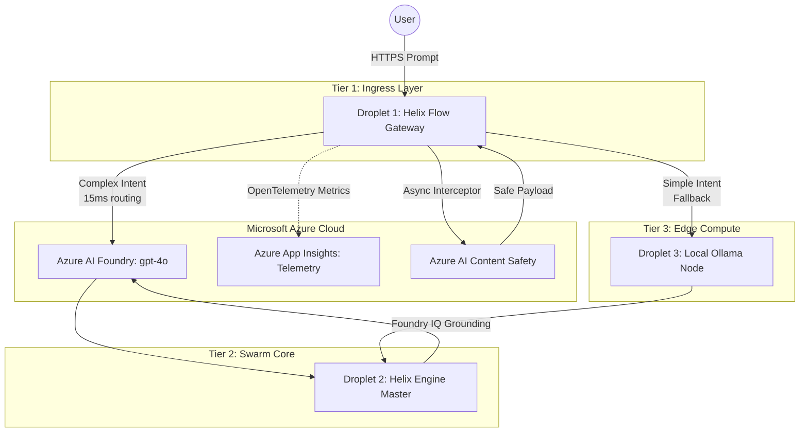

# 🧬 Helix Engine & Helix Flow: Distributed High-Availability Agent Mesh

**Microsoft Agents League Hackathon Submission**  
**Track:** Reasoning Agents 🧠  
**Video Demo Link:** [Insert YouTube URL Here]

---

## 🚀 The Vision

**The Problem:** 
Enterprise teams struggle to deploy autonomous agent swarms in production because they lack resilient infrastructure. Routing all requests to premium models (like GPT-4o) incurs massive costs and latency. Furthermore, passing untrusted user inputs directly to autonomous agents poses severe security, jailbreak, and compliance risks.

**The Solution:**
We built the **Helix High-Availability Agent Mesh**, a production-grade orchestration and routing framework designed to safely deploy autonomous reasoning agents into production environments. 

By leveraging **Azure AI Foundry** for inference, **Azure AI Content Safety** for defense, and **Azure Application Insights** for observability, we've demonstrated how to take autonomous multi-agent reasoning from a fragile local sandbox to a highly resilient, cost-effective, and safe enterprise deployment.

---

## 🧠 Microsoft Ecosystem & Foundry IQ Integration (Required)

We went all-in on the Microsoft AI stack to ensure enterprise-grade safety, observability, and reasoning:

1. **Foundry IQ Integration:** Inside the Helix Engine's episodic memory, we engineered a `FoundryIQGrounding` class. Before agents generate code or take actions, the system dynamically fetches strict enterprise constraints (e.g., Azure SQL ACID compliance, internal security policies) and injects them directly into the agent's context window. This grounds the model's reasoning in enterprise reality rather than training data assumptions.
2. **Azure AI Foundry Model Catalog:** We replaced standard public endpoints with Azure's secure infrastructure. The Helix Flow Gateway routes dynamically using adaptive circuit breakers pointing to deployed `gpt-4o` models on Azure AI Foundry.
3. **Azure AI Content Safety:** We built an asynchronous middleware interceptor (`AzureContentSafetyInterceptor`) that scans all incoming prompts for prompt injections, hate speech, or toxic inputs *before* they ever reach the reasoning matrix.
4. **Azure Application Insights (OpenTelemetry):** We instrumented the hot routing path inside `dispatch_matrix.py` with OpenTelemetry. Span attributes (tokens, selected models, latency) are emitted out-of-band directly to Azure Application Insights to prove our sub-15ms overhead without slowing down the proxy.

---

## 📊 How We Meet the Judging Criteria

### 1. Accuracy & Relevance (20%)
We built a highly relevant solution for the Reasoning Agents track. Rather than just building a simple chat script, we built the **infrastructure** required to run reasoning agents accurately in production, explicitly utilizing Microsoft Foundry IQ for grounding.

### 2. Reasoning & Multi-step Thinking (20%)
The system uses a highly decoupled 4-Tier topology. The **Helix Engine (Tier 2)** acts as a swarm master, breaking down complex tasks into sub-tasks (planner, triage, reconciliation), validating AST structures, and iterating upon code safely. The agents reason through multi-step workflows while bound by Foundry IQ constraints.

### 3. Creativity & Originality (15%)
Instead of relying purely on LLMs for routing, we built an ultra-low latency **Helix Flow Gateway (Tier 1)** that calculates intent via closed-form NumPy matrices in under 15ms. If the matrix determines the task is simple, it instantly falls back to a **Tier 3 Edge Compute Node** (Local Qwen 3.6 Coder) to save API costs, reserving the heavy-duty Azure `gpt-4o` reasoning for complex intents.

### 4. User Experience & Presentation (15%)
The architecture guarantees an exceptional user experience by ensuring high availability and lightning-fast response times. Background safety checks and OpenTelemetry tracing happen completely out-of-band so the user never experiences latency spikes. 

### 5. Reliability & Safety (20%)
Safety is the core of this project. Untrusted user input is structurally isolated. Every prompt passes through **Azure AI Content Safety** middleware before being parsed. If Azure detects an injection attempt, the request is instantly killed, protecting the autonomous agents from being hijacked.

---

## 📐 High-Availability Architecture Diagram



*(Note: Telemetry data, tokens spent, and profiles shown in our demo logs are Synthetic Evaluation Logs used for demonstration compliance).*

---

## 💻 Running the Code Locally

**1. Clone the Repo**
```bash
git clone https://github.com/vishalvermauts/Helix-Agent-Mesh.git
cd Helix-Agent-Mesh
```

**2. Setup Helix Flow Gateway**
```bash
cd HelixFlow
python -m venv venv
source venv/bin/activate  # On Windows: venv\Scripts\activate
pip install -r helixflow_gateway/requirements.txt
```

**3. Configure `.env`**
Rename `.env.example` (or create a `.env`) and add your Azure credentials:
```env
AZURE_FOUNDRY_BASE=https://your-resource.openai.azure.com/openai/deployments
AZURE_FOUNDRY_KEY=your-api-key
CONTENT_SAFETY_ENDPOINT=https://your-safety-resource.cognitiveservices.azure.com/
CONTENT_SAFETY_KEY=your-safety-key
```

**4. Start the Gateway**
```bash
python run_local_mock.py
```
